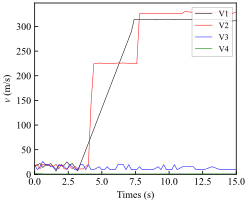
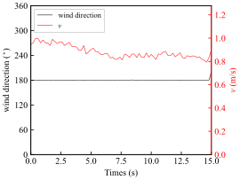
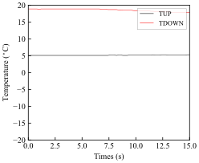
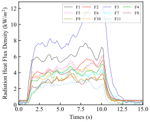
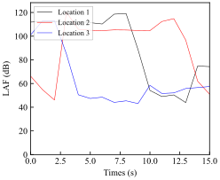

# PlotFiguresForGasReleaseProject
bad project, never use it

当前目录下面有三个py文件，分别为：
- fileRename.py  :  用来重命名文件名称，文件名成顺序是一一对应的
- dataSort.py    :  用来合并相同文件名称的文件到一个csv文件中，中间还需要处理一下数据
- dataPlot.py    :  用来根据文件名称画图的，会画7种不同的图

依赖：numpy, pandas, matplotlib

图片展示：
|Pressure|velocity|wind direction|temperature|burned heat flux or unburned fuels|sound|
|-|-|-|-|-|-|
|||||||
